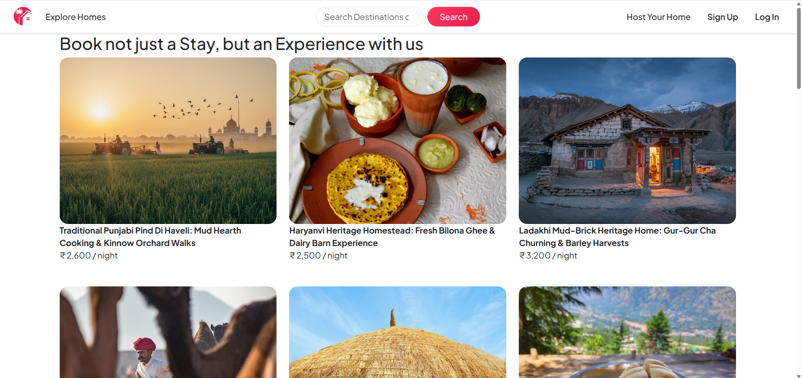
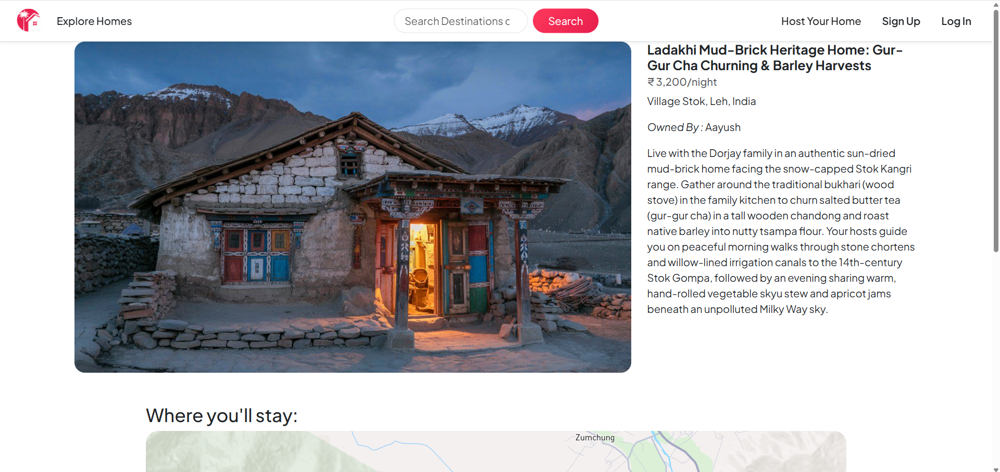
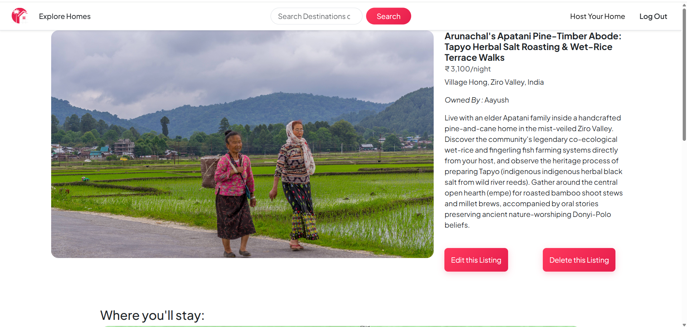
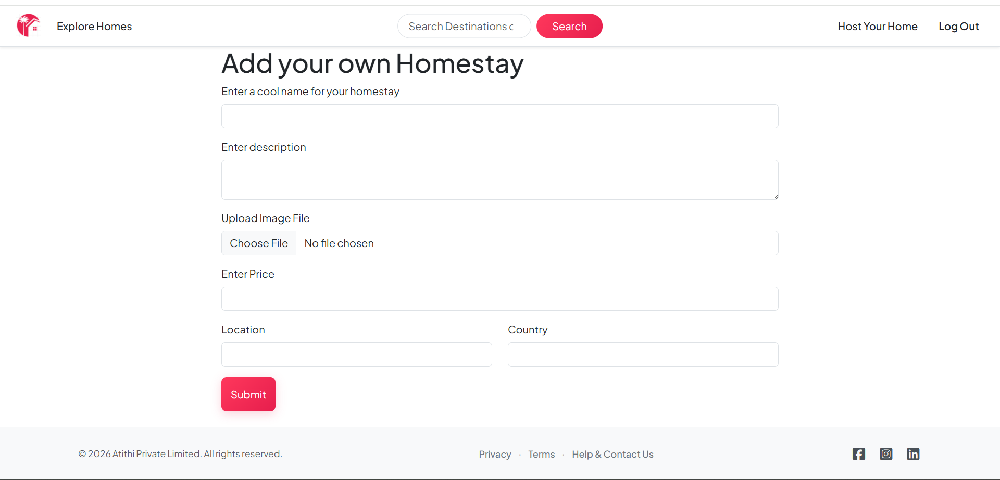
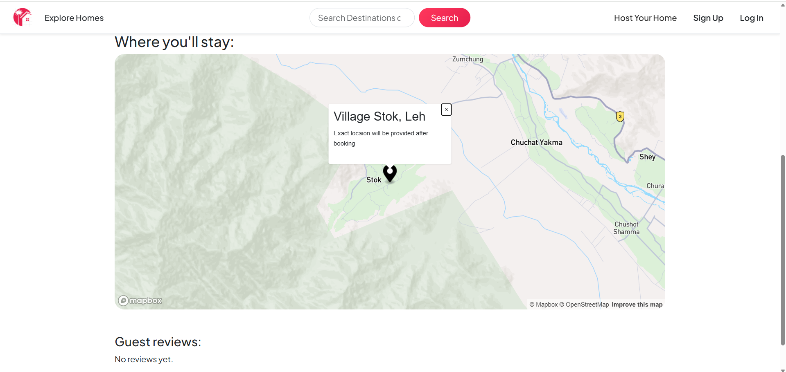
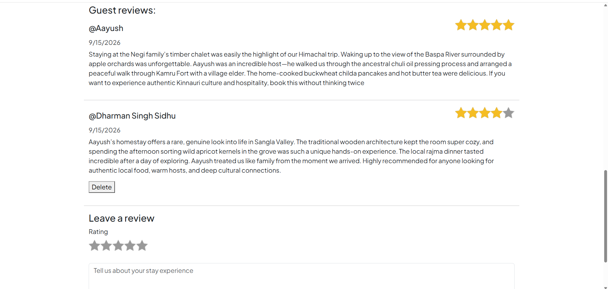

# 🏡 Atithi Sanskriti — Homestay & Cultural Platform

> Discover local *sanskriti*, authentic regional food, and firsthand cultural experiences through unique stays.

---

## Inspiration & Motivation

While traveling, I realized that modern travel often misses the heart of local cultures, traditions, and authentic regional food. **Atithi** was born out of a personal desire to bridge that gap—creating a platform that connects travelers directly with local hosts to promote and experience rich local *sanskriti* firsthand.

---
## Deployment

* Live Link: https://atithi-o7pu.onrender.com/
* Hosting Platform: Render

## Screenshots

| Homepage Catalog | Detailed Listing View |
| :---: | :---: |
|  |   |

| Add New Homestay | Interactive Map Location |
| :---: | :---: |
|  |  |

| Reviews & Ratings Section |
| :---: |
|  |

## Key Features & Technical Implementations

### Authentication & Authorization
* **Secure User Management:** Integrated `passport` and `passport-local` for authentication with salted password hashing.
* **Access Control:** Restricted CRUD capabilities so users can only edit, update, or delete their own listings and reviews.

### Session & Cookie Management
* **Stateful User Sessions:** Utilized `express-session`, `cookie-parser`, and `connect-mongo` to maintain persistent user activity and manage session storage across Atlas.
* **User Feedback:** Leveraged `connect-flash` to display dynamic flash notifications for actions like logins, listing creation, or errors.

### Architecture, Routing & Middlewares
* **MVC Pattern:** Structured code using the **Model-View-Controller** design pattern with express routers and custom controllers for clean separation of concerns.
* **Custom Middlewares:** Built middleware checks to enforce authentication status, listing ownership, and schema validations.

### Validation & Error Handling
* **Dual-Layer Validation:** Implemented client-side HTML/JS checks alongside robust server-side schema validations using **Joi**.
* **Async Error Wrapping:** Used a custom `wrapAsync` utility function to handle asynchronous errors smoothly without crashing the server.

### Maps, Media & Data Storage
* **Map Rendering:** Integrated **Mapbox** with **GeoJSON** for interactive listing location previews.
* **Image Cloud Storage:** Configured **Cloudinary** for image uploads, URL transformations, and image preview handling.
* **Cloud Database & Seeding:** Configured MongoDB schemas on **MongoDB Atlas** with automated seeding scripts (`init/index.js`).

## Tech Stack

**Frontend:**
* HTML5, CSS3, JavaScript (ES6+)
* Bootstrap 5 & EJS (Embedded JavaScript Templates)
* Mapbox GL JS (GeoJSON integration)

**Backend:**
* Node.js & Express.js
* Passport.js (`passport-local`)
* Joi (Server-side schema validation)
* Express-Session, Cookie-Parser, Connect-Flash

**Database & Cloud Services:**
* MongoDB Atlas & Mongoose ODM
* Connect-Mongo (Session Store)
* Cloudinary (Image Hosting)
* Render (Production Hosting)

## Environment Variables

Create a `.env` file in the root directory and define the following variables:

```env
ATLASDB_URL=your_mongodb_atlas_connection_string
SECRET=your_express_session_secret
CLOUD_NAME=your_cloudinary_cloud_name
CLOUD_API_KEY=your_cloudinary_api_key
CLOUD_API_SECRET=your_cloudinary_api_secret
MAP_TOKEN=your_mapbox_access_token

```

## Local Setup

1. Clone the repository:
git clone https://github.com/your-username/atithi.git
cd atithi
2. Install dependencies:
npm install
3. Seed the database:
node init/index.js
4. Start the server:
node app.js
5. Open http://localhost:8080 in your browser.

## Project Structure

```text
Atithi/
├── controllers/
│   ├── helpControl.js         # Logic for help and contact forms
│   ├── listingControl.js      # Controller logic for listing CRUD operations
│   ├── reviewControl.js       # Controller logic for reviews and ratings
│   └── userControl.js         # Controller logic for user auth actions
├── init/
│   ├── data.js                # Initial dataset for seeding listings
│   └── index.js               # Database seeding execution script
├── models/
│   ├── contactMsgSchema.js    # Mongoose schema for contact messages
│   ├── listingSchema.js       # Schema for listings (price, location, image, owner)
│   ├── reviewSchema.js        # Schema for listing reviews and ratings
│   └── userSchema.js          # Passport-enabled user account schema
├── public/
│   ├── css/
│   │   ├── ratings.css        # Custom CSS for star rating components
│   │   └── styles.css         # Main application stylesheet
│   ├── images/
│   │   ├── atithiLogo.png     # Primary branding logo
│   │   ├── logo.png           # General logo asset
│   │   └── smollLogo.png      # Compact logo for navigation bar
│   └── js/
│       ├── map.js             # Mapbox map initialization script
│       └── script.js          # Client-side form validation scripts
├── routes/
│   ├── help.js                # Express router for help and policy pages
│   ├── listing.js             # Express router for homestay listings
│   ├── review.js              # Express router for listing reviews
│   └── user.js                # Express router for user authentication
├── utils/
│   ├── expressError.js        # Custom Express error class
│   └── wrapAsync.js           # Utility function to catch asynchronous errors
├── views/
│   ├── help/
│   │   ├── contact.ejs        # Contact form template
│   │   ├── privacy.ejs        # Privacy policy page
│   │   └── terms.ejs          # Terms and conditions page
│   ├── includes/
│   │   ├── flash.ejs          # Partial template for flash messages
│   │   ├── footer.ejs         # Global footer component
│   │   └── navbar.ejs         # Global navigation header
│   ├── layouts/
│   │   └── boilerplate.ejs    # Master HTML layout structure
│   ├── listings/
│   │   ├── create.ejs         # New listing creation form
│   │   ├── edit.ejs           # Listing update form
│   │   ├── error.ejs          # Global error view template
│   │   ├── index.ejs          # All listings catalog page
│   │   └── show.ejs           # Detailed individual listing page
│   ├── users/
│   │   ├── login.ejs          # User login form
│   │   └── signup.ejs         # User registration form
│   └── homepage.ejs           # Landing page template
├── .env                       # Local environment configuration file
├── .gitignore                 # Git ignore directives
├── app.js                     # Primary Express server application
├── cloudConfig.js             # Cloudinary storage and Multer integration
├── middleware.js              # Authorization and schema validation middleware
├── package.json               # Dependencies and scripts manifest
└── schema.js                  # Joi validation schemas for listings and reviews
```
## Database Schema & Data Models

Atithi utilizes MongoDB with Mongoose ODM to model relational data using document referencing.

### Schemas

* User Schema: Stores user credentials (`email`, `username`) and handles password security via hashing and salting.
* Listing Schema: Stores homestay details (`title`, `description`, `price`, `location`, `country`), GeoJSON coordinates for Mapbox, Cloudinary image details (`url`, `filename`), and references to the owner (`User`) and reviews (`Review`).
* Review Schema: Stores feedback details (`rating`, `comment`, `createdAt`) and references the review author (`User`).
* Contact Message Schema: Stores user inquiries (`email`, `message`, category) regarding hosting, guest queries, or bug reports.

### Relationships

* User -> Listing (One-to-Many): One user can create and own multiple listings.
* User -> Review (One-to-Many): One user can write multiple reviews across different listings.
* Listing -> Review (One-to-Many): One listing can hold references to multiple guest reviews.
* User -> Contact Message (One-to-Many): One user or visitor can submit multiple support messages.
  


## Future Scope

* Pan-India Expansion: Onboard verified hosts across various Indian states, with a focus on regional heritage sites, eco-stays, and rural tourism.
* Integrated Booking & Payments: Implement secure payment gateway integration (Razorpay / UPI) to handle real-time reservations, security deposits, and host payouts.
* Host Identity Verification: Incorporate KYC verification for hosts to build trust and safety for incoming travelers.
* Localization & Regional Languages: Add multi-language support (Hindi and regional languages) so local hosts in tier-2, tier-3, and rural areas can easily manage listings.
* Cultural Experiences & Workshops: Expand listing offerings beyond accommodations to include authentic local food workshops, artisan crafts, and guided regional tours hosted by locals.
